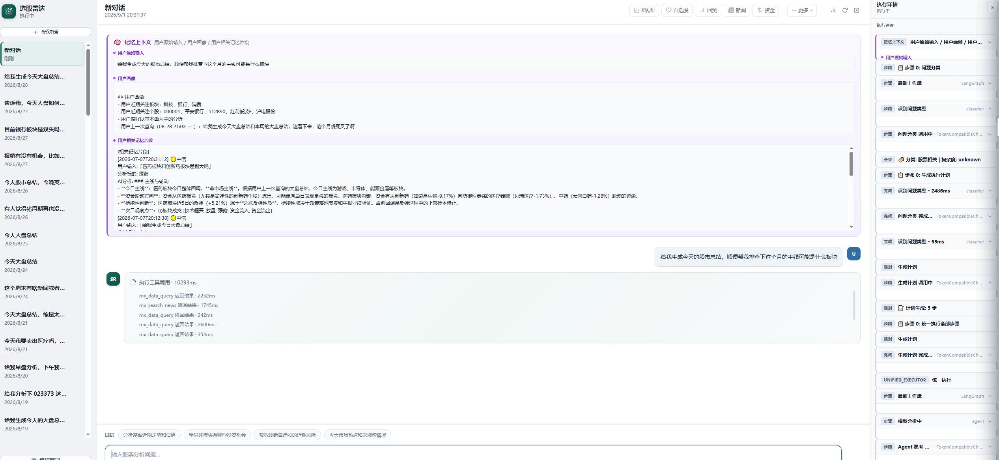
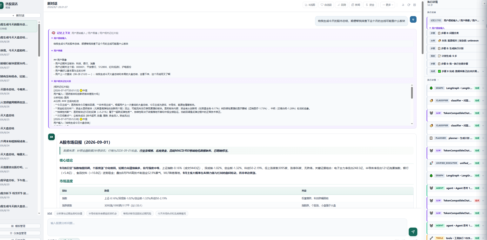
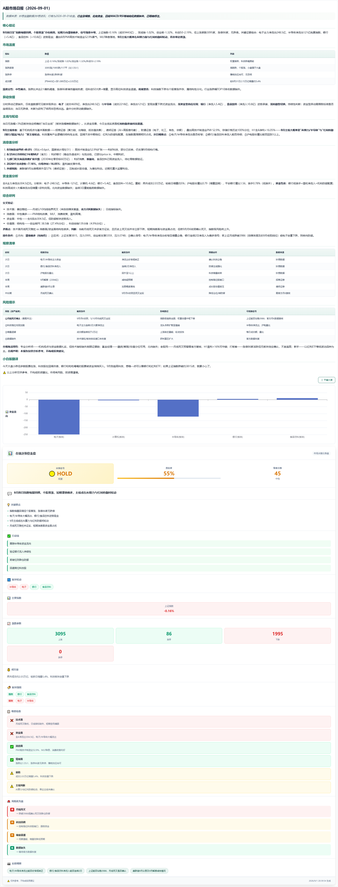
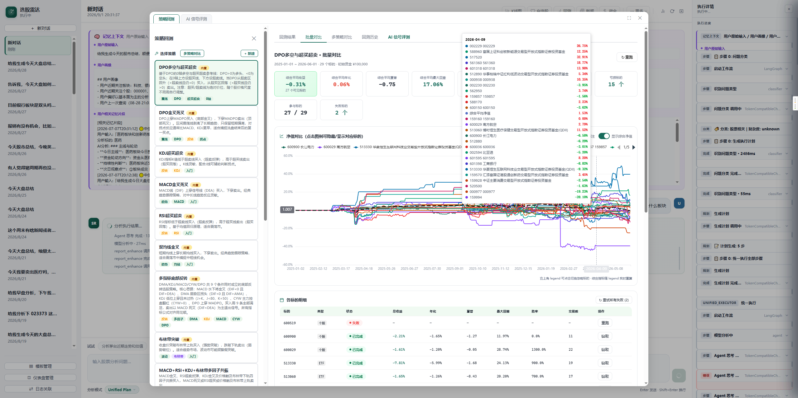
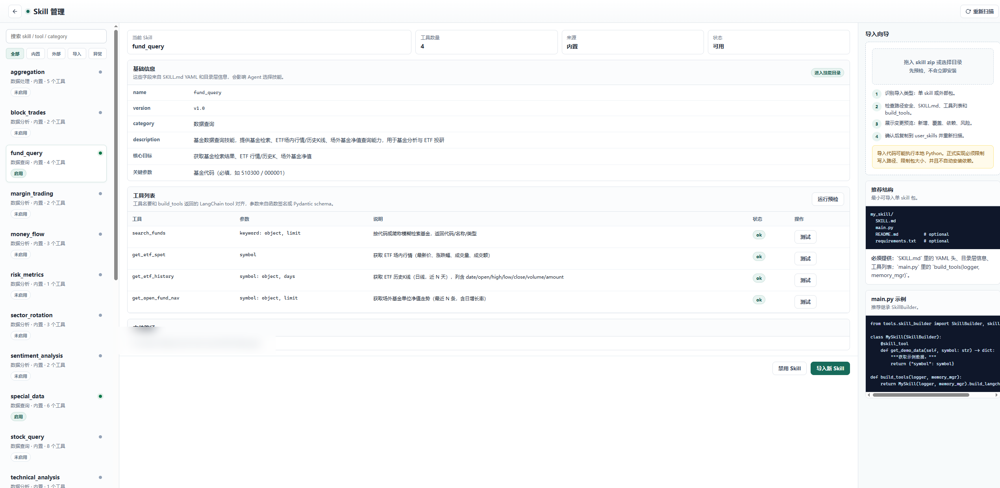
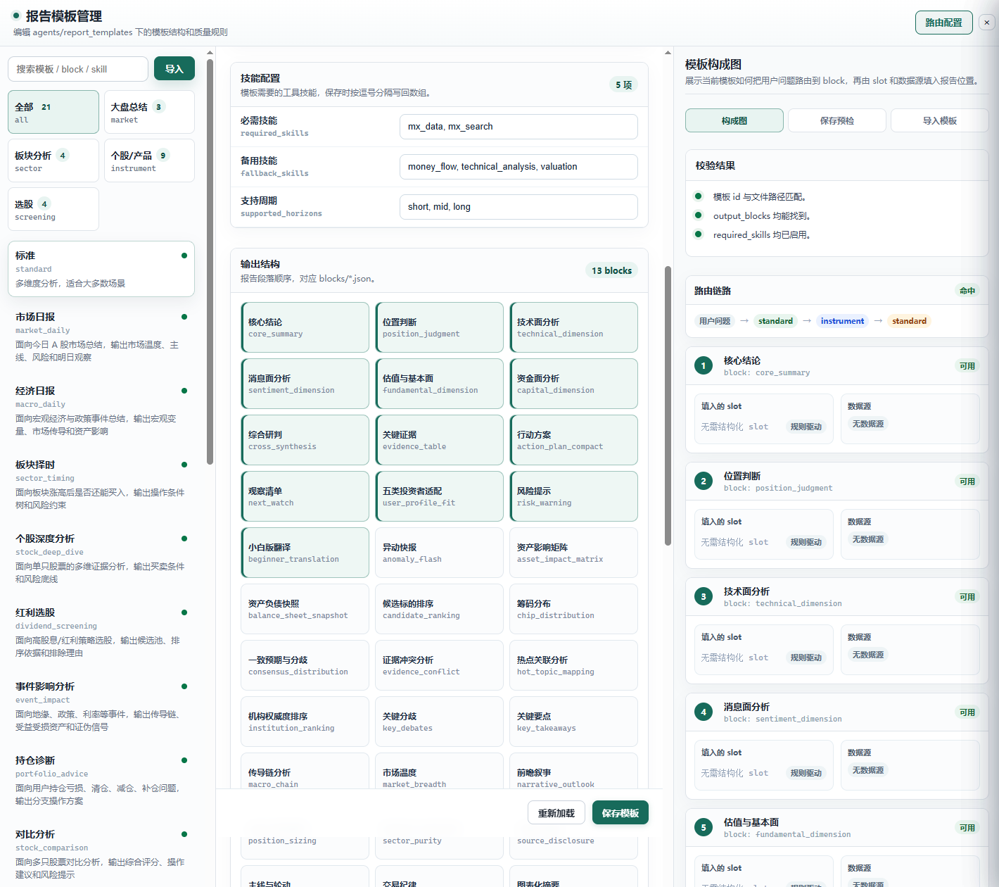
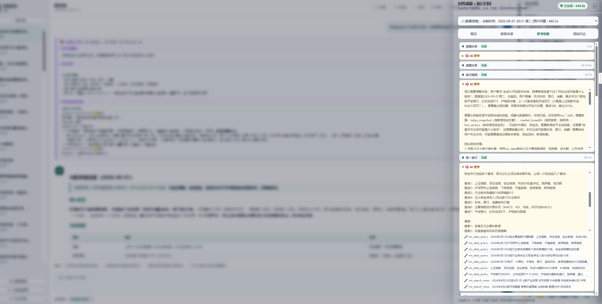
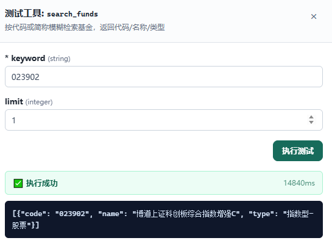

# 选股雷达 Stock Radar

基于 LLM + LangGraph 的 A 股智能分析 Agent。用自然语言提问即可完成选股、行情查询、技术分析、估值测算、新闻情绪分析、板块轮动等全链路分析。

---

## ⚠️ 免责声明

**本项目仅供学习和研究使用，不构成任何投资建议。**

- 本项目输出的全部内容（包括但不限于分析报告、技术指标、选股结果、估值结论、板块判断）均由大语言模型自动生成，**可能存在事实错误、数据延迟、逻辑缺陷或完全错误的推断**。
- 本项目**不是**持牌投资咨询机构，开发者**不具备**证券投资咨询业务资格，输出内容不属于《证券投资顾问业务暂行规定》所指的投资建议。
- **请勿将本项目的任何输出作为买入、卖出或持有任何证券的唯一依据。** 据此操作，风险自负，盈亏自担。
- 数据来自第三方公开接口，可能存在延迟、缺失或错误，请以交易所及券商官方行情为准。
- 使用本项目产生的 API 调用费用、数据服务费用及其他成本由使用者自行承担。

完整条款见 [DISCLAIMER.md](DISCLAIMER.md)。继续使用本项目即视为你已阅读并同意上述条款。

---

## 功能特性

| 能力 | 说明 |
| --- | --- |
| 自然语言交互 | 中文提问即可驱动完整分析流程，无需记忆命令 |
| 6 种 Agent 模式 | ReAct / Plan & Solve / Unified Plan / PDOR / Scenario / Agent Group，按问题复杂度切换 |
| 11+ 数据源 | Sina、AKShare、BaoStock、eFinance、Tushare、PyTdx、腾讯、同花顺官方、yfinance、Finnhub、Longbridge，按优先级自动降级 |
| 12 个内置技能 | 行情查询、技术指标、估值、资金流、板块轮动、龙虎榜、融资融券、风险度量、情绪分析、基金查询、聚合统计、特殊数据 |
| 三维预算控制 | Token / LLM 调用次数 / 时间，超限时中断并提示，防止成本失控 |
| 调用链追踪 | 完整 Agent 执行链路持久化到 SQLite，支持溯源回放 |
| 记忆系统 | FTS5 全文检索 + 向量检索 + RRF 混合召回，可选的 Cross-Encoder 精排 |
| 回测引擎 | 基于 Backtrader，支持策略回测与指标计算 |
| Web 工作台 | FastAPI + 前端面板，支持对话、配置、回测、决策仪表盘 |
| 通知推送 | 钉钉 / 飞书 / 企业微信 / Telegram / 邮件 / Webhook 等 12 种渠道 |

<<<<<<< HEAD
## 界面预览

**Web 工作台 —— 对话分析**

用自然语言提问，Agent 自动调度数据源与技能完成分析，右侧实时展示执行链：

| 对话首页 | 分析执行过程 |
| --- | --- |
|  |  |

**市场日报与决策建议** —— 自动生成当日市场总结、板块强度与持仓建议：



**更多能力面板**

| 回测引擎 | Skill 管理 |
| --- | --- |
|  |  |

| 报告模板管理 | 回答溯源 | 工具在线测试 |
| --- | --- | --- |
|  |  |  |

=======
>>>>>>> 40f79ac43b822a00c433a4e67548cf3c2313df0d
## 快速开始

### 环境要求

- Python **3.11+**
- **TA-Lib** C 库（技术指标计算依赖，需单独安装）

### 安装

```bash
# 1. 克隆仓库
git clone https://github.com/wode98k233/stock_agent.git
cd stock_agent

# 2. 创建虚拟环境
python -m venv .venv
.venv\Scripts\activate          # Windows
# source .venv/bin/activate    # Linux / macOS

# 3. 安装依赖
pip install -r requirements.txt
```

**TA-Lib 安装**（最容易卡住的一步）：

```bash
# Windows：下载对应 Python 版本的 .whl 后本地安装
#   https://github.com/cgohlke/talib-build/releases
pip install TA_Lib-0.4.xx-cp311-cp311-win_amd64.whl

# Ubuntu / Debian
sudo apt install libta-lib0-dev ta-lib && pip install TA-Lib

# macOS
brew install ta-lib && pip install TA-Lib
```

### 配置

```bash
cp .env.example .env
```

**最小可用配置**——只需填一个 LLM Key：

```env
OPENAI_API_KEY=sk-xxxxxx
OPENAI_API_BASE=https://api.deepseek.com/v1    # 以 DeepSeek 为例
OPENAI_MODEL_NAME=deepseek-chat
```

其余数据源（Tushare、同花顺、妙想等）全部可选，留空则自动禁用对应数据源，项目仍可正常运行。

> 完整配置项说明见 [.env.example](.env.example)，共 200+ 项，均已注释。

### 运行

```bash
# TUI 工作台（推荐）
python main.py

# 传统 REPL
python main.py --cli

# 一次性提问，执行完即退出
python main.py "分析一下贵州茅台的估值"

# Web 工作台
python -m server
# 浏览器打开 http://127.0.0.1:8000
```

## 使用示例

```
> 今日涨幅超过5%且市值大于100亿的股票有哪些
> 对比宁德时代和比亚迪的估值
> 半导体板块最近一周的资金流向
> 600519 的技术面怎么样
> 帮我看看我的自选股有没有风险
```

CLI 内以 `/` 开头执行命令：

| 命令 | 作用 |
| --- | --- |
| `/help` | 查看全部命令 |
| `/mode` | 切换 Agent 模式 |
| `/skills` | 查看已加载技能 |
| `/status` | 查看会话状态与预算消耗 |
| `/config` | 查看当前配置 |
| `/trace` | 调用链追踪与溯源 |
| `/watchlist` | 管理自选股 |
| `/templates` | 切换报告模板 |
| `/notify` | 发送通知测试 |
| `/logs` | 查看日志 |
| `/session` | 会话管理 |
| `/calendar` | 交易日历 |

## 项目结构

```
stock_agent/
├── main.py              # CLI 入口
├── config.py            # 配置中心（读取 .env，定义全部可调参数）
├── launcher.py          # 启动器
├── agents/              # Agent 层：6 种执行模式
│   ├── react/           #   ReAct 快速响应
│   ├── plan/            #   Plan & Solve / Unified Plan
│   ├── pdor/            #   PDOR 深度研究
│   ├── group/           #   多 Agent 协作群
│   ├── scenarios/       #   场景化路由
│   └── report_templates/#   报告模板
├── tools/               # 工具层
│   ├── fetcher/         #   数据源（各 *_ds.py 继承 DataSource 基类）
│   ├── skills/          #   技能包（每技能一个目录：main.py + SKILL.md）
│   ├── other_skills/    #   第三方技能包
│   ├── skill_register.py#   技能自动发现与注册
│   └── tech_indicators.py / valuation.py / sentiment.py ...
├── memory/              # 记忆系统（FTS5 / Embedding / Hybrid 三后端）
├── backtest/            # 回测引擎
├── server/              # Web 服务（FastAPI + 前端）
├── cli/                 # 命令行交互层
├── utils/               # 通用工具（LLM 网关、缓存、日志、预算、追踪）
└── test/                # 测试（279 个文件，unit / integration / e2e）
```

## Agent 模式

| 模式 | 注册名 | 适用场景 |
| --- | --- | --- |
| ReAct | `react_stock` | 默认模式，边思考边调用工具，响应快 |
| Plan & Solve | `plan_solve` | 先规划再执行，适合多步骤复杂问题 |
| Unified Plan | `unified_plan` | 规划与执行统一图，减少状态切换开销 |
| PDOR | `pdor` | Plan-Do-Observe-Replan 循环，适合开放式研究 |
| Scenario | `scenario` | 意图识别后路由到专用场景处理器 |
| Agent Group | `agent_group` | 多 Agent 并行协作，适合大批量对比分析 |

运行时用 `/mode <名称>` 切换，或修改 `.env` 中的默认模式。

## 数据源

数据源按**优先级**自动选择，失败自动降级到下一个。默认优先级：

| 数据源 | 优先级 | 需要 Key |
| --- | --- | --- |
| 东方财富妙想 (MX) | 110 | `MX_APIKEY` |
| Sina | 100 | 否 |
| 同花顺官方 | 95 | `HITHINK_FINANCE_API_KEY` |
| AKShare | 90 | 否 |
| eFinance | 80 | 否 |
| PyTdx | 75 | 否 |
| BaoStock | 70 | 否 |
| Tushare | 60 | `TUSHARE_TOKEN` |
| 腾讯 | 50 | 否 |
| Finnhub | 48 | `FINNHUB_API_KEY` |
| yfinance | 45 | 否 |

优先级可通过环境变量覆盖，例如 `SINA_PRIORITY=120`。

Longbridge（港美股）已实现但默认未注册，需要时在 `tools/fetcher/__init__.py` 中加一行 `DataSourceManager.register_source(LongbridgeDataSource)`（默认优先级 35）。

## 测试

```bash
pytest -m unit              # 纯逻辑单测，不联网
pytest -m integration       # 集成测试，需要网络
pytest -m e2e               # 端到端测试，需要 LLM API
pytest -m "not e2e" -q      # 除 e2e 外全部
```

## 二次开发

想加数据源、加技能、加 Agent 模式或改报告模板？见 [CONTRIBUTING.md](CONTRIBUTING.md)。

## 常见问题

**Q：只填了 LLM Key，能用吗？**
能。Sina、AKShare、eFinance 等免费源无需 Key，覆盖行情、K 线、财务、板块等核心数据。

**Q：TA-Lib 装不上怎么办？**
Windows 用户优先用 [cgohlke/talib-build](https://github.com/cgohlke/talib-build/releases) 的预编译 wheel，不要尝试从源码编译。

**Q：为什么首次启动很慢？**
首次启动会初始化 jieba 分词（约 1-2 秒）和记忆数据库。如需节省内存，可在 `.env` 设置 `JIEBA_ENABLED=false`。

**Q：如何降低 API 成本？**
调低 `MAX_TOKENS_PER_QUERY` 与 `MAX_LLM_CALLS_PER_QUERY`；开启 `CACHE_PREFIX_ENABLED=true` 利用 DeepSeek / OpenAI 的 prompt caching（分别约 90% / 50% 折扣）；用较便宜的模型处理报告合成与工具压缩（`REPORT_LLM_MODEL` / `COMPRESS_LLM_MODEL`）。

## 许可证

本项目采用 [GNU General Public License v3.0](LICENSE)。

GPL-3.0 是强 copyleft 协议：如果你分发本项目的修改版本，必须以同等协议开放源代码。

`tools/other_skills/10jqka/` 下的第三方技能包使用 MIT 许可证，见各自目录下的 `LICENSE.txt` / `README.md`。

---

**再次提醒：本项目输出不构成投资建议，请勿据此决策。详见 [DISCLAIMER.md](DISCLAIMER.md)。**
